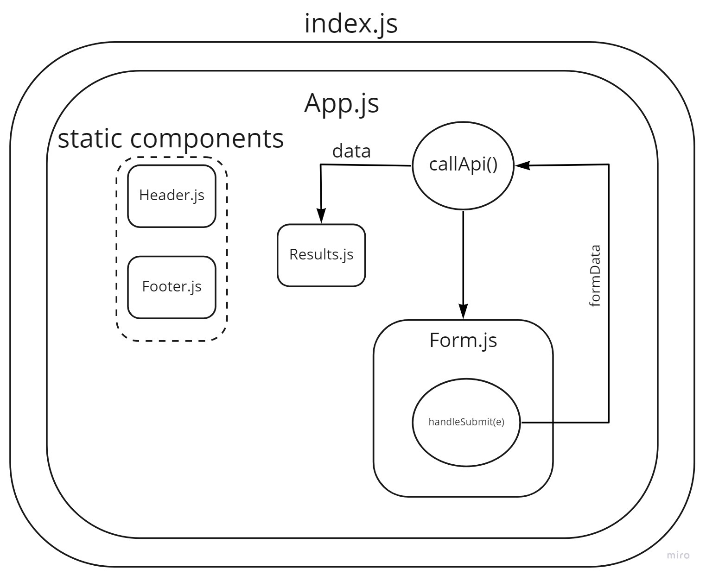

# RESTy

### Author : Hatem Husnieh

## install

1. copy the link of the repo
1. clone the repo on your local machine by `git clone repo-url`
1. download independencies by `npm i`
1. run the app

## Deploy, Run and Test - Version 1.0.0

- [Pull Request](https://github.com/Hatemhusnieh/RESTy/pull/1)
- [SandBox](https://codesandbox.io/s/magical-golick-4x3cu?file=/resty/src/App.js)

### Setup

#### Running the app

- `npm start`

### UML:

---

## Deploy, Run and Test - Version 1.1.0

- [Deployed Link](https://resty-hatem.netlify.app/)
- [Pull Request](https://github.com/Hatemhusnieh/RESTy/pull/2)
- [SandBox](https://codesandbox.io/s/loving-dust-mc8dp)

### Setup

#### Running the app

- `npm start`

### UML:

## Deploy, Run and Test - Version 1.2.0

- [Deployed Link](https://resty-hatem.netlify.app/)
- [Pull Request](https://github.com/Hatemhusnieh/RESTy/pull/5)
- [SandBox](https://codesandbox.io/s/friendly-haze-c3kry)

### Setup

#### Running the app

- `npm start`

### UML:

